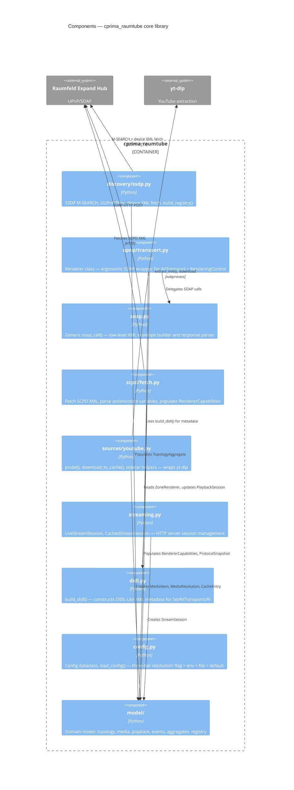

# C4 Level 3: Components

Components within the `src/cprima_raumtube/` core library.

---

---

## Component Responsibilities

| Component | Owns | Does not own |
|---|---|---|
| `discovery/ssdp.py` | Device discovery, registry building | Capability probing (→ `scpd/fetch.py`) |
| `upnp/transport.py` | Renderer API (set_uri, play, stop, seek, volume) | SOAP envelope construction (→ `soap.py`) |
| `soap.py` | HTTP POST, XML envelope, fault parsing | Domain knowledge |
| `scpd/fetch.py` | SCPD download, parse, capability mapping | Storing capabilities (→ model) |
| `sources/youtube.py` | yt-dlp integration, sidecar JSON | Streaming (→ `streaming.py`) |
| `streaming.py` | HTTP session lifecycle, Range responses | SOAP control (→ `upnp/transport.py`) |
| `didl.py` | DIDL-Lite XML construction | UPnP protocol details |
| `config.py` | Config loading and merging | Application state |
| `model/` | Domain entities, aggregates, events | I/O, networking |
