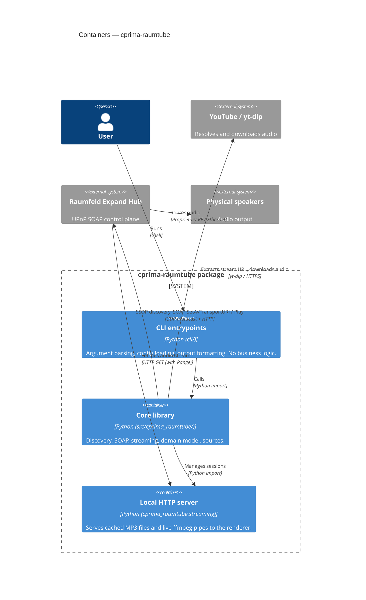

# C4 Level 2: Containers

The major deployable / importable units within `cprima-raumtube`.

---

---

## Container Descriptions

### `cli/` — CLI Entrypoints

Three thin scripts, one per command. Each:
1. Calls `_compat.ensure_utf8_stdout()`.
2. Parses args with `argparse`.
3. Calls `load_config()`, applies CLI overrides.
4. Delegates entirely to `cprima_raumtube.*`.

Contains zero business logic.

### `src/cprima_raumtube/` — Core Library

The installable package. Sub-packages:

| Sub-package | Purpose |
|---|---|
| `discovery/` | SSDP M-SEARCH, device registry |
| `upnp/` | `Renderer` class — ergonomic SOAP wrapper |
| `scpd/` | SCPD fetch, parse, capability extraction |
| `sources/` | `AudioSource` protocol, `YouTubeSource` |
| `model/` | Domain model (topology, media, playback, events, registry) |

Top-level modules: `soap.py`, `devices.py`, `didl.py`, `streaming.py`, `config.py`.

### `cprima_raumtube.streaming` — Local HTTP Server

Runs in-process on a configurable port (default 8080).
Two session types:
- `CachedStreamSession` — serves a static file with `Accept-Ranges: bytes`.
- `LiveStreamSession` — pipes ffmpeg stdout; no Range support.

Each session has a UUID URL path (see ADR-004).
