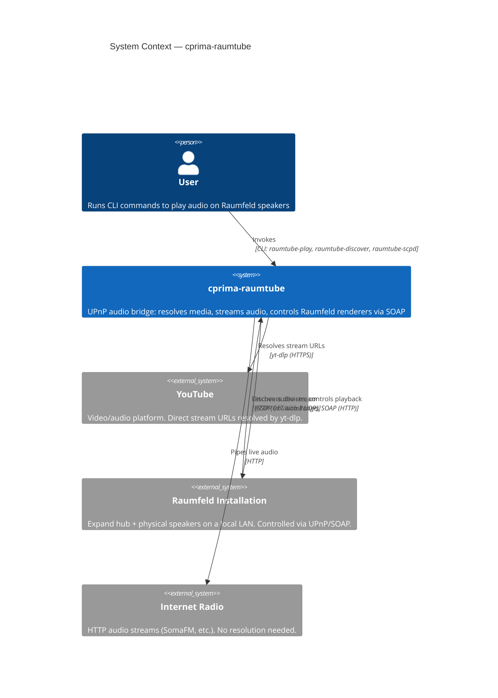

# C4 Level 1: System Context

How `cprima-raumtube` fits into its environment.

---

---

## Narrative

The user has one or more Raumfeld multiroom audio installations on local LANs.
`cprima-raumtube` bridges between the user's intent (play this YouTube URL on that zone)
and the Raumfeld UPnP control plane (SOAP actions on AVTransport).

For YouTube content, the system uses `yt-dlp` to resolve an ephemeral CDN URL,
downloads the audio to a local cache, and serves it over HTTP to the renderer.

For internet radio and other HTTP streams, the system pipes the live byte stream
to the renderer without caching.

The Raumfeld installation is treated as an external system: `cprima-raumtube` never
modifies device firmware or configuration — it only uses the standard UPnP/SOAP protocol.
