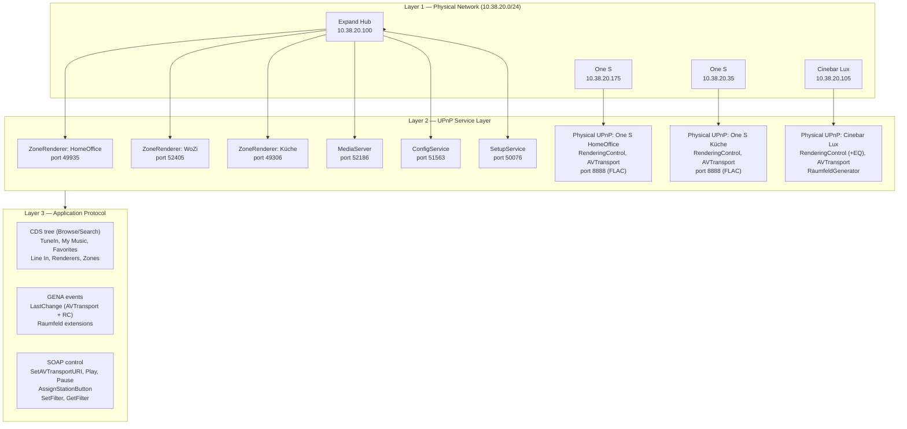

# Reverse Engineering Report — Teufel/Raumfeld Multiroom System

**Evidence grades:** `[CONFIRMED]` SOAP response received · `[OBSERVED]` seen in GENA/HTTP ·
`[APK]` from JADX-decompiled app · `[INFERRED]` logical conclusion · `[UNTESTED]` in SCPD only ·
`[HTTP-500]` action exists but returned 500

---

## Executive Summary

The Teufel/Raumfeld multiroom audio system is a hub-and-spoke UPnP AV installation in which a
single Expand hub device (firmware 2.17.4) acts as the sole UPnP authority for all zone-level
playback [CONFIRMED]. The system communicates exclusively over standard UPnP SOAP and GENA on the
local network — no cloud dependency, no proprietary binary protocol, no WebSocket layer
[CONFIRMED]. The main finding of this reverse-engineering effort is that the full feature set of
the system (zone transport, multi-speaker synchronization, preset buttons, configuration
persistence, EQ control, and line-in streaming) is accessible through documented UPnP service
interfaces plus a small set of vendor-defined SOAP actions that conform to the UPnP extension
model.

---

## System Architecture

The Expand hub functions as the UPnP authority for the entire installation. It synthesizes one
virtual `MediaRenderer:1` device per configured zone, each on a distinct TCP port, and hosts a
`MediaServer:1` (ContentDirectory), a `ConfigDevice`, and a `SetupService` — all as separate
logical UPnP devices on the same physical IP address [CONFIRMED].

Physical speakers (One S, Cinebar Lux) are conventional IP devices on the same LAN subnet. They
expose their own UPnP services for device-local operations, but they are not the target of any
playback control SOAP call. The hub mediates all transport commands and routes audio internally
[CONFIRMED].

---

## Protocol Coherence

The Raumfeld system uses standard UPnP AVTransport:1 for all transport operations (Play, Pause,
Stop, SetAVTransportURI, Seek, Next, Previous) [CONFIRMED]. Media browsing and station button
management go through standard ContentDirectory:1 [CONFIRMED]. Volume and mute use standard
RenderingControl:1 [CONFIRMED]. Connection negotiation uses ConnectionManager:1 [CONFIRMED].

Proprietary extensions are confined to the defined UPnP extension points: vendor-prefixed SOAP
actions appended to standard service SCPDs (e.g., `BendAVTransportURI`, `EnterManualStandby`,
`AssignStationButton`), and vendor-namespaced DIDL-Lite metadata elements (`raumfeld:button`,
`raumfeld:ebrowse`, `raumfeld:durability`, etc.) [APK, CONFIRMED]. No undocumented HTTP APIs,
no WebSocket connections, no JSON-RPC endpoints, and no cloud-mediated control paths were found
on any device [CONFIRMED].

The system is therefore fully controllable from any standards-compliant UPnP control point, with
Raumfeld-specific features accessible by adding the vendor-defined actions to the controller.

---

## Station Button Mechanism

The preset button workflow is a two-phase protocol entirely within standard UPnP [CONFIRMED]:

1. **Assignment** — The app presents the user with a CDS browser. The user selects a content item
   (e.g., a TuneIn station at CDS path `0/RadioTime/Search/s-s44975`). The app calls
   `ContentDirectory.AssignStationButton(Renderer, Button, ObjectID)` on the MediaServer
   (port 52186). The `Renderer` argument is the **physical speaker UDN**, not the zone renderer
   UDN.

2. **Hub-side resolution** — The hub resolves the `ObjectID` to a concrete playback URL at
   assignment time — for TuneIn stations, this is the actual HTTP stream URL returned by the
   TuneIn OPML API, embedded as a `<res>` element. The hub stores this resolved item in the CDS
   tree at `0/Renderers/{physical-speaker-udn}/StationButtons/{n}` [CONFIRMED].

3. **Button press** — The physical button press triggers playback using the pre-stored `<res>`
   URL. No CDS lookup occurs at playback time [CONFIRMED].

4. **Snapshot semantics** — The resolved URL is captured at assignment time. If the external
   service (e.g., TuneIn) changes the stream URL, the stored button becomes stale until the user
   reassigns it [INFERRED from stored-URL behaviour].

The Spotify variant of this flow passes a serialized JSON `SpotifyMetadata` blob in the
`OptionalMetadata` argument of `AssignStationButton` [APK].

---

## GENA Event Extensions

Raumfeld extends the standard UPnP event model transparently within the `LastChange` event
variable — the same variable used by all standard UPnP renderers [OBSERVED]. No separate
subscription endpoint and no out-of-band notification channel is required.

The following non-standard state variables appear in the `LastChange` body of **AVTransport**
events from zone renderers [OBSERVED]:

- `RoomStates` — per-room playback state within the zone, formatted as
  `{room-uuid}={PLAYING|STOPPED|…}`. Enables a control point to distinguish which physical
  speaker within a multi-speaker zone is active without querying each speaker individually.
- `SleepTimerActive` / `SecondsUntilSleep` — sleep timer state mirrored into every AVTransport
  event notification.
- `ContentType` — MIME type of the currently playing stream (empty when stopped).
- `Bitrate` — current stream bitrate in bits per second (0 when stopped).

The following non-standard variables appear in **RenderingControl** events [OBSERVED]:

- `RoomVolumes` — per-room volume within the zone.
- `RoomMutes` — per-room mute state within the zone.

A standard UPnP control point subscribed to these event URLs receives the Raumfeld extensions
inside the standard `LastChange` XML document, alongside the standard variables, without any
explicit opt-in.

---

## Physical Speaker Independence

Physical speakers expose their own UPnP services and can be addressed directly, independently of
the hub, for certain operations [CONFIRMED]:

**One S speakers (10.38.20.175, 10.38.20.35):** RenderingControl (volume), AVTransport,
ConnectionManager [CONFIRMED]. Port 8888 serves a live FLAC stream of the analog line-in input —
always running, requiring no setup [CONFIRMED].

**Cinebar Lux (10.38.20.105):** RenderingControl with three-band EQ (`GetFilter`/`SetFilter`,
centidB values) [CONFIRMED], stereo balance (`GetBalance`/`SetBalance`) [HTTP-500 during test],
named filter toggle (`ToggleFilter` for `stereo-widening`) [UNTESTED], AVTransport with
`SetNextAVTransportURI` for gapless transitions [CONFIRMED], and a `RaumfeldGenerator` service
with an empty SCPD [OBSERVED].

These physical-device services work regardless of hub state. An EQ adjustment sent directly to
`http://10.38.20.105:58305/RenderingControl/ctrl` takes effect immediately and persists across
zone reassignments [CONFIRMED].

---

## What Requires Hub Mediation

The following operations must be directed to services on the Expand hub (10.38.20.100) and cannot
be performed by addressing physical speakers directly:

- **Zone transport control** — `SetAVTransportURI`, `Play`, `Pause`, `Stop`, `Seek`, `Next`,
  `Previous` must target the virtual zone renderer on the hub [CONFIRMED].
- **Multi-speaker zone synchronization** — the hub's internal routing delivers synchronized audio
  to all speakers in a zone; there is no SOAP mechanism to achieve this by talking to physical
  speakers [INFERRED].
- **ContentDirectory browsing** — `Browse` and `Search` on the CDS tree are served by the hub's
  MediaServer (port 52186) [CONFIRMED].
- **Station button management** — `AssignStationButton` and `GetStationButtonAssignment` target
  the MediaServer on the hub [CONFIRMED].
- **ConfigService preferences** — hub-resident key-value store; physical speakers have no
  equivalent service [CONFIRMED].
- **SetupService operations** — firmware version queries, OTA updates, network info [CONFIRMED].

---

## What Can Bypass the Hub

The following operations can be performed by communicating directly with physical speaker IPs,
bypassing the hub entirely:

- **Line-in FLAC stream** — HTTP GET to `http://{one-s-ip}:8888/stream.flac` delivers a live
  chunked FLAC stream with no authentication [CONFIRMED].
- **EQ control (Cinebar Lux)** — `GetFilter`/`SetFilter` on the Cinebar's own RenderingControl
  service adjust treble/mid/bass independently [CONFIRMED].
- **Standby control** — `EnterManualStandby`, `EnterAutomaticStandby`, `LeaveStandby` are also
  present on physical speaker AVTransport services [OBSERVED in SCPD].
- **System sounds (Cinebar Lux)** — `PlaySystemSound` on the Cinebar's RenderingControl service
  plays a local beep (`Success` or `Failure`) [UNTESTED directly, listed in SCPD].

---

## Open Questions

The following areas remain unexplored or unresolved after this investigation:

1. **`BendAVTransportURI` semantics** — present in the zone renderer SCPD but not yet called.
   Possibly a smooth mid-stream URL handoff (cross-fade or gapless transition without stop/play
   cycle).
2. **`SetResourceForCurrentStream`** — presumably hot-swaps the resource URL for a running
   stream; behaviour and valid call timing unknown.
3. **`GetSpotifyPreset` with active session** — returned HTTP 500 during testing (no active
   Spotify session). Behaviour with a logged-in Spotify account is untested.
4. **`SetPreferences` payload format** — the RSA-encrypted blob format and the key-value schema
   inside it are unknown; only the encryption mechanism is understood (RSA-1024, public key from
   `GetPublicKey`) [APK].
5. **`RaumfeldGenerator` service** — registered on the Cinebar Lux with an empty SCPD. Purpose
   unknown; possibly related to tone generation, DTMF, or test signals.
6. **Room UUID assignment mechanism** — it is unknown how the hub assigns `room UUID` values
   (distinct from zone renderer UDNs and physical speaker UDNs) and under what conditions they
   change.
7. **`Scenes` and `CustomStreams` CDS containers** — both appear in the app source [APK] but
   return HTTP 500 when browsed. Possibly requires firmware configuration not present in this
   installation.
8. **`SetNextStartTriggerTime`** — listed in the Cinebar SCPD with `TimeService` and `StartTime`
   arguments; scheduled playback semantics and time format unknown [UNTESTED].
9. **Port 8888 on Cinebar Lux** — port is open and responds to HTTP but the Cinebar has digital
   inputs only and is not listed in the CDS `0/Line In` container. Stream content unknown
   [UNTESTED].
10. **Multi-speaker zone group formation** — the SOAP call or hub event that triggers zone merger
    and the resulting coordinator UDN assignment have not been observed. The group model is
    inferred from APK source only [APK].

---

## Methodology

All findings in this document were produced using the following methods, without any deep packet
inspection or hardware disassembly:

- **SCPD enumeration** — UPnP SSDP discovery followed by fetching all `devicedesc.xml` and
  service SCPD URLs to build a complete service/action inventory.
- **Live SOAP probing** — Python `urllib` HTTP client sending hand-crafted SOAP envelopes to
  each discovered control URL, exercising every action in the SCPD with minimal valid arguments.
- **GENA subscription** — local Python HTTP server receiving `NOTIFY` messages; subscribed to
  AVTransport and RenderingControl event URLs on all three zone renderers.
- **HTTP endpoint scan** — HTTP GET to port 80 on all devices and to all known UPnP service ports
  at path `/`; no scan of unpublished port ranges.
- **Android APK decompilation** — Teufel app APK decompiled with JADX; Java source analyzed for
  action names, argument formats, content model classes, and capability flags.

No Wireshark or network-level packet capture was used. No hardware was opened. No credentials were
brute-forced. Firmware version under test: **2.17.4**, protocolVersion **16351**.
