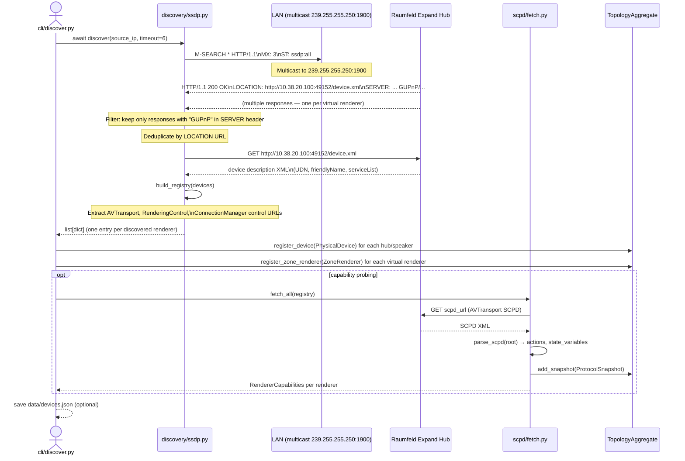

# Sequence: SSDP Discovery

This diagram covers device discovery from M-SEARCH multicast through to a populated `TopologyAggregate`.

---

## Sequence Diagram

---

## Key Points

- Discovery binds to `NetworkProfile.effective_source_ip` for the SSDP socket (important on Windows for correct multicast binding).
- The GUPnP filter limits responses to the Raumfeld/Teufel device stack; third-party UPnP devices on the LAN are ignored.
- Deduplication is by `LOCATION` URL — the hub sends one response per virtual renderer, all at the same host IP.
- `build_registry()` extracts control URLs from the device XML's `<serviceList>` and returns structured dicts.
- SCPD fetch is optional at discovery time; capability probing can be deferred to first use of a renderer.
- `ProtocolSnapshot` stores raw SCPD XML for offline analysis and debugging (see `model/protocol.py`).
- `data/devices.json` is gitignored; it is the persistent cache of the last discovery result.
