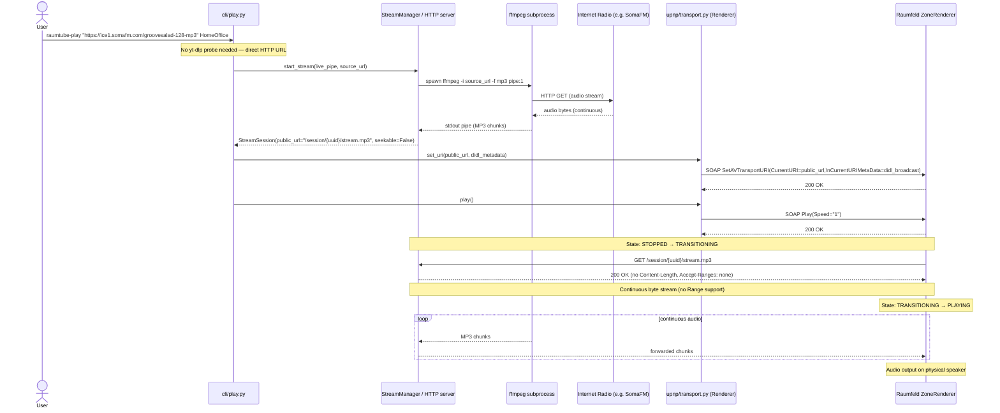

# Sequence: Radio / Live Stream Playback (Live Pipe Mode)

This diagram covers playback of an internet radio stream or other live HTTP audio source,
using `live_pipe` stream mode (ffmpeg piped to the HTTP server; no caching).

---

## Sequence Diagram



---

## Key Differences vs. Cached File Mode

| Aspect | Live Pipe | Cached File |
|---|---|---|
| `StreamSession.mode` | `live_pipe` | `cached_file` |
| `StreamSession.seekable` | `False` | `True` |
| `Accept-Ranges` header | `none` | `bytes` |
| `Content-Length` header | absent | present |
| HTTP status code | `200` | `200` or `206` (with Range) |
| Renderer can seek | No | Yes |
| Dropout recovery | Restart from live position | Re-issue Range request |
| DIDL class | `audioBroadcast` | `audioItem` |

---

## DIDL Metadata for Live Streams

```python
build_didl(uri, title, live=True)
# → upnp:class = object.item.audioItem.audioBroadcast
```

Using `audioBroadcast` signals to the renderer that the stream is infinite and non-seekable.
Some renderers suppress seek controls on the display when this class is set.

---

## Notes

- ffmpeg must be installed and on `PATH`.
- If ffmpeg or the radio source fails, `StreamSession.state` transitions to `failed`.
- The renderer may reconnect after a dropout using the same UUID URL — it receives the live stream from the current position (no rewind).
- `GetPositionInfo` returns `TrackDuration = "NOT_IMPLEMENTED"` for live streams.
- `Pause` is unreliable for live streams — see ADR-002.
