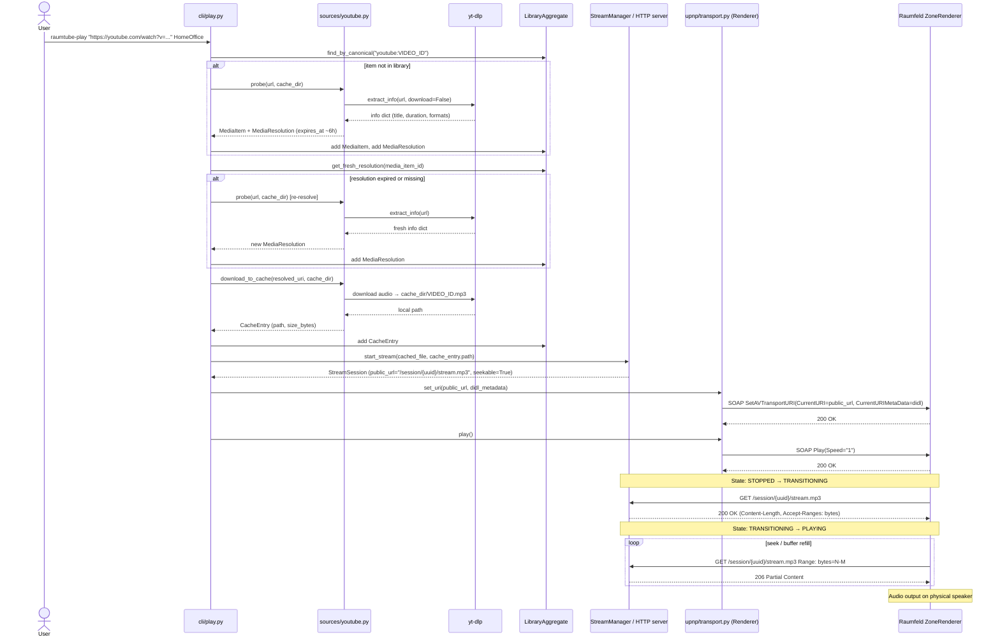

# Sequence: YouTube Playback (Cached File Mode)

This diagram covers the full flow from CLI invocation to audio output on a Raumfeld renderer,
using `cached_file` stream mode (downloaded to disk, served with HTTP Range support).

---

## Sequence Diagram

---

## Key Points

- `yt-dlp` is called at most twice per play: once for metadata (probe), once for download.
- `MediaResolution` expiry is checked before download; re-resolve if expired (see ADR-003).
- The HTTP server serves the cached file with `Accept-Ranges: bytes`; the renderer uses Range requests for seeking and buffering.
- The UUID path in the stream URL prevents stale renderer reconnects from hitting a new session (see ADR-004).
- `didl_metadata` is built by `didl.build_didl(uri, title, live=False, duration=N)`.
- Transport state transitions (`STOPPED → TRANSITIONING → PLAYING`) are observable via `GetTransportInfo`.
