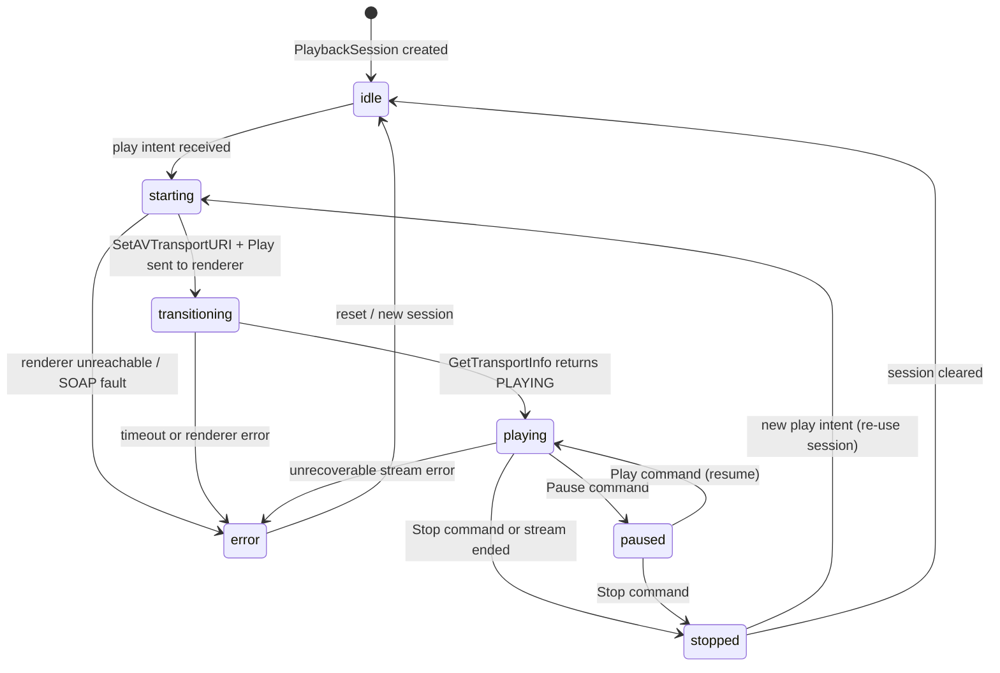

# State Machine: PlaybackSession

Source: `model/playback.py` — `PlaybackSession.state`
One `PlaybackSession` exists per zone in `PlaybackAggregate.playback_sessions`.

---

## State Diagram

---

## State Reference

| State | Meaning | `is_active` |
|---|---|---|
| `idle` | No playback intent; session unused | `False` |
| `starting` | SOAP commands sent; waiting for renderer | `True` |
| `transitioning` | Renderer in TRANSITIONING state | `True` |
| `playing` | Audio confirmed playing | `True` |
| `paused` | Playback paused; position held | `True` |
| `stopped` | Playback stopped; session reusable | `False` |
| `error` | Unrecoverable error; session must be reset | `False` |

`PlaybackSession.is_active` returns `True` for `starting`, `transitioning`, `playing`, `paused`.

---

## Relationship to Transport State

`PlaybackSession.state` is the **application-level** view; `TransportState.state` is the **UPnP-level** view.

| PlaybackSession | TransportState |
|---|---|
| `starting` | `STOPPED` (URI just set) |
| `transitioning` | `TRANSITIONING` |
| `playing` | `PLAYING` |
| `paused` | `PAUSED_PLAYBACK` |
| `stopped` | `STOPPED` |

The application derives `PlaybackSession.state` by polling `GetTransportInfo` and mapping the result.
`PlaybackSession.transport_state` holds the raw snapshot.
