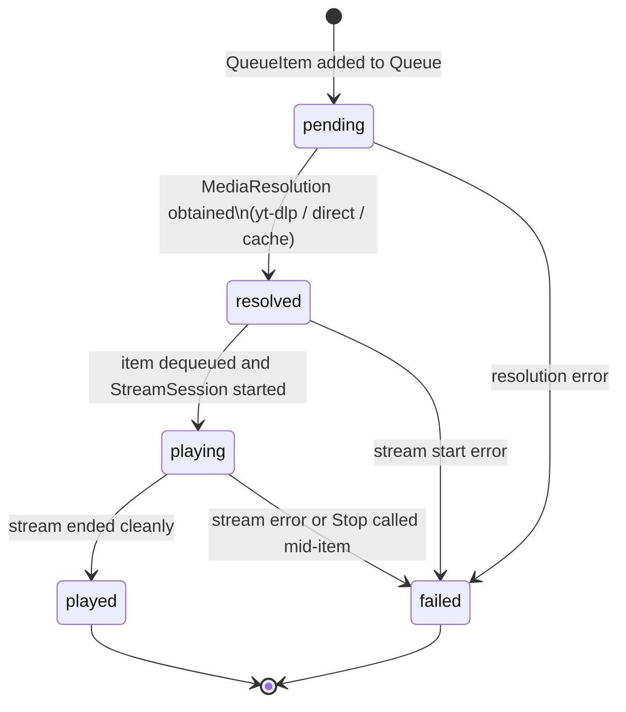

# State Machine: QueueItem

Source: `model/media.py` — `QueueItem.state`
One `QueueItem` per slot in a zone's `Queue`.

---

## State Diagram

---

## State Reference

| State | Meaning |
|---|---|
| `pending` | Item in queue; no stream URL resolved yet |
| `resolved` | `resolved_stream_id` populated; ready to play |
| `playing` | Currently streaming to the renderer |
| `played` | Completed successfully |
| `failed` | Resolution or streaming error; item is skipped |

---

## Notes

- `QueueItem.media_item_id` references a `MediaItem` in `LibraryAggregate` — it is never embedded directly (avoids stale object graphs).
- `QueueItem.resolved_stream_id` references a `StreamSession.id` once resolved.
- Resolution is triggered by the playback engine before the item reaches the renderer; the item moves `pending → resolved` asynchronously.
- When `Queue.consume_mode` is `True`, `played` items are removed from the queue immediately after playback ends.
- `failed` items are left in the queue for inspection; the playback engine advances to the next item.
