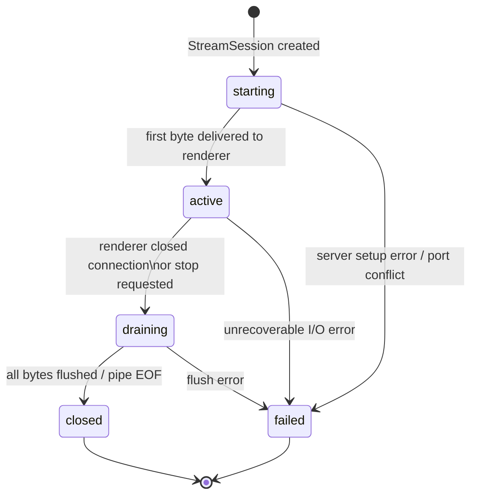

# State Machine: StreamSession

Source: `model/streaming.py` — `StreamSession.state`
Managed by: `cprima_raumtube.streaming` (HTTP server implementation)

---

## State Diagram

---

## State Reference

| State | Meaning | `is_alive` |
|---|---|---|
| `starting` | Server handler created; waiting for first renderer connection | `True` |
| `active` | Renderer connected; bytes flowing | `True` |
| `draining` | Renderer disconnected; flushing remaining data or waiting for EOF | `True` |
| `closed` | Session ended cleanly; handler released | `False` |
| `failed` | Unrecoverable error; session unusable | `False` |

`StreamSession.is_alive` returns `True` for `starting`, `active`, `draining`.

---

## Mode Differences

| Mode | `starting → active` trigger | `active → draining` trigger |
|---|---|---|
| `cached_file` | First `GET /session/{uuid}/stream.mp3` received | Renderer closes TCP connection or `stop()` called |
| `live_pipe` | ffmpeg subprocess started and first chunk written | ffmpeg EOF or process terminated |
| `direct_url` | Session is informational only; renderer fetches URL directly | Always transitions directly to `closed` |

---

## Lifecycle Notes

- A session enters `starting` when the CLI calls `StreamManager.start_stream()` and the HTTP server
  registers the UUID route.
- The renderer may not connect immediately. If the renderer never connects (e.g. bad URL passed to
  `SetAVTransportURI`), the session stays in `starting` indefinitely until a timeout fires.
- For `live_pipe`, `draining` is brief — ffmpeg terminates and the pipe closes.
- For `cached_file`, `draining` may last several seconds if the renderer is buffering a large file.
- Sessions in `closed` or `failed` state are safe to remove from `PlaybackAggregate.stream_sessions`.
- Per ADR-004, each session has a unique UUID path — stale renderer reconnects using old UUIDs
  receive 404 and cannot accidentally enter a new session.

---

## Relationship to Model

- `StreamSession` lives in `PlaybackAggregate.stream_sessions` (keyed by `StreamSession.id`).
- `PlaybackSession.stream_session_id` references the current active session for a zone.
- `QueueItem.resolved_stream_id` references the session ID once the item is resolved for playback.
