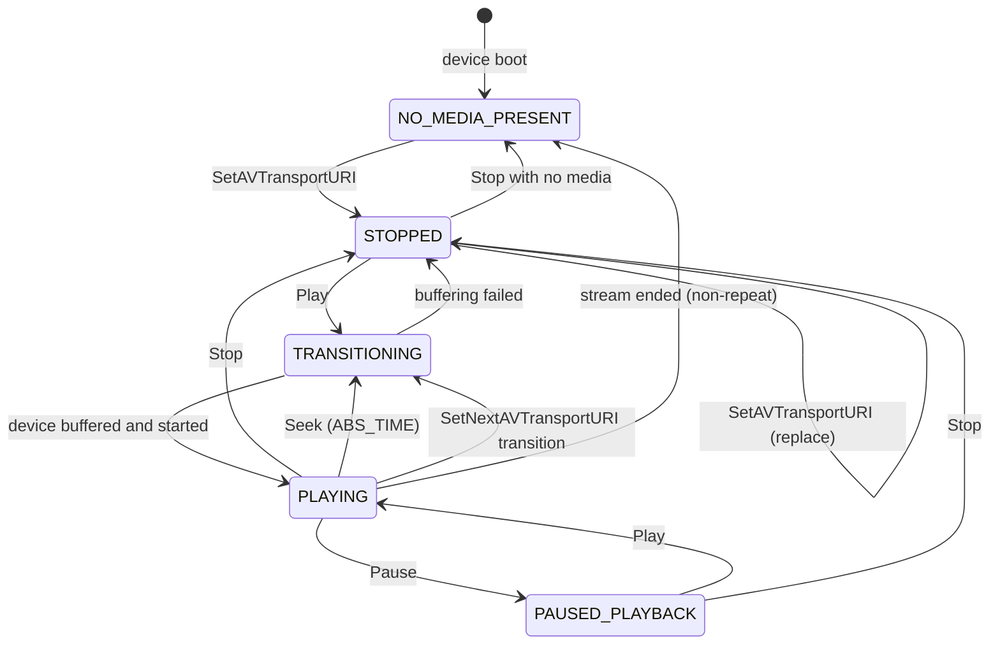

# State Machine: UPnP AVTransport

Source: `model/playback.py` — `TransportState.state`
Queried via: `GetTransportInfo` SOAP action on the `AVTransport` service.

---

## State Diagram

---

## State Reference

| State | Meaning | `is_playing` | `is_stopped` |
|---|---|---|---|
| `NO_MEDIA_PRESENT` | No URI set; renderer idle | `False` | `True` |
| `STOPPED` | URI set but not playing | `False` | `True` |
| `TRANSITIONING` | Buffering / seeking in progress | `False` | `False` |
| `PLAYING` | Audio output active | `True` | `False` |
| `PAUSED_PLAYBACK` | Paused mid-track | `False` | `False` |

---

## Transition Triggers

| From | To | Trigger |
|---|---|---|
| `NO_MEDIA_PRESENT` | `STOPPED` | `SetAVTransportURI` |
| `STOPPED` | `TRANSITIONING` | `Play` |
| `TRANSITIONING` | `PLAYING` | Device internal (buffering complete) |
| `TRANSITIONING` | `STOPPED` | Buffering failure / network error |
| `PLAYING` | `PAUSED_PLAYBACK` | `Pause` |
| `PAUSED_PLAYBACK` | `PLAYING` | `Play` |
| `PLAYING` | `STOPPED` | `Stop` |
| `PAUSED_PLAYBACK` | `STOPPED` | `Stop` |
| `PLAYING` | `TRANSITIONING` | `Seek` (then back to `PLAYING`) |
| `PLAYING` | `NO_MEDIA_PRESENT` | Stream ended (no repeat) |

---

## Timing Notes

- `TRANSITIONING` duration varies: **1–5 seconds** for cached files, **2–10 seconds** for live streams.
- Poll `GetTransportInfo` every 1–2 seconds during `TRANSITIONING` to detect when playback starts.
- `PAUSED_PLAYBACK` on a live pipe is implementation-dependent; some renderers stop buffering and
  cannot resume cleanly — treat it as `STOPPED` in that case.
- After `SetAVTransportURI`, state moves to `STOPPED` before `Play` is called. Do not call `Play`
  before confirming the URI was accepted (`GetMediaInfo` returns a non-empty `CurrentURI`).

---

## Relationship to Model

- `TransportState` in `model/playback.py` snapshots the current UPnP state at a point in time.
- `PlaybackSession.transport_state` holds the most recent snapshot.
- `TransportEvent` (in `model/events.py`) records each state change with `old_state` and `new_state`.
