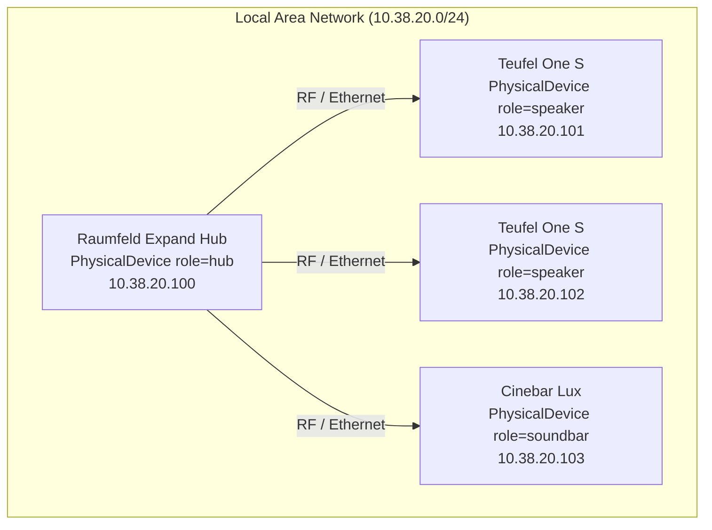
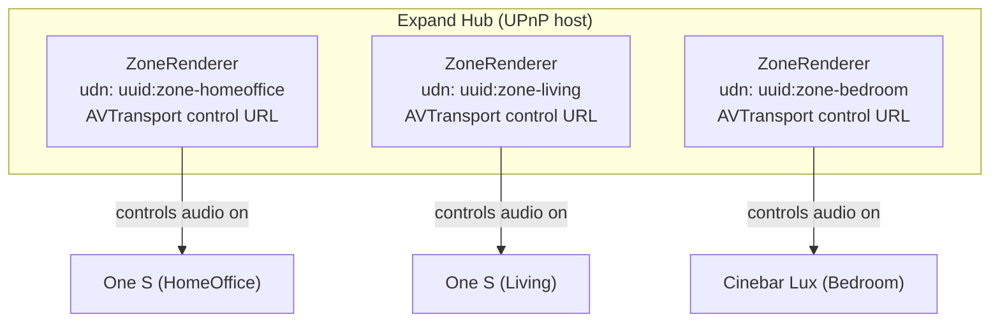

# Raumfeld Topology

This document describes the physical and logical topology of a Raumfeld/Teufel multiroom audio system
as modelled in `cprima_raumtube`.

---

## Physical Deployment



The Expand hub is the only device that speaks standard UPnP/SOAP to the LAN.
Physical speakers connect to the hub over a proprietary protocol and do **not** expose SOAP services directly.

---

## Logical (UPnP) Topology



Each `ZoneRenderer` is a virtual UPnP device synthesized by the Expand hub.
Its UDN and control URLs are **different** from the physical speaker's UDN.
See ADR-001.

---

## Model Hierarchy

```
RaumtubeRegistry
└── Installation  (id="home", name="Home", network=NetworkProfile)
    └── System
        └── TopologyAggregate
            ├── physical_devices
            │   ├── PhysicalDevice(udn="uuid:expand-...", role="hub")
            │   ├── PhysicalDevice(udn="uuid:ones-...", role="speaker")
            │   └── PhysicalDevice(udn="uuid:cinebar-...", role="soundbar")
            ├── rooms
            │   ├── Room(id="r-homeoffice", name="HomeOffice")
            │   ├── Room(id="r-living",     name="Living")
            │   └── Room(id="r-bedroom",    name="Bedroom")
            ├── zones
            │   ├── Zone(id="z-homeoffice", renderer_udn="uuid:zone-homeoffice")
            │   ├── Zone(id="z-living",     renderer_udn="uuid:zone-living")
            │   └── Zone(id="z-bedroom",    renderer_udn="uuid:zone-bedroom")
            ├── zone_renderers
            │   ├── ZoneRenderer(udn="uuid:zone-homeoffice", ...)
            │   ├── ZoneRenderer(udn="uuid:zone-living",     ...)
            │   └── ZoneRenderer(udn="uuid:zone-bedroom",    ...)
            └── groups
                └── (empty when no multiroom group is active)
```

---

## Zone → Renderer Resolution

To send a SOAP command to a zone:

```
zone = topology.get_zone("z-homeoffice")
renderer = topology.get_renderer_for_zone("z-homeoffice")
# renderer.avt_control_url  →  "http://10.38.20.100:49935/TransportService/Control"
```

`get_renderer_for_zone()` looks up `zone.renderer_udn` in `zone_renderers`.
All SOAP calls go to the renderer's control URL — never directly to a physical device IP.

---

## Coordinator Roles (Single Zone vs. Group)

### Single Zone

```
Zone(id="z-homeoffice")
└── coordinators: []   ← empty; renderer_udn is the transport target
```

In single-zone mode, `Zone.renderer_udn` is used directly as the transport controller.

### Multiroom Group

```
Group(id="g-1", coordinator_zone_id="z-homeoffice", member_zone_ids=["z-homeoffice", "z-living"])
Zone(id="z-homeoffice")
└── coordinators:
    ├── Coordinator(renderer_udn="uuid:group-master-...", role="group_master")
    ├── Coordinator(renderer_udn="uuid:clock-...",        role="clock_master")
    └── Coordinator(renderer_udn="uuid:zone-homeoffice",  role="transport")
```

Playback commands go to the `transport` coordinator's UDN, which may differ from the zone's base renderer.
See ADR-005.

---

## Group Semantics

| Field | Meaning |
|---|---|
| `Group.coordinator_zone_id` | The zone whose transport coordinator drives all group members |
| `Group.member_zone_ids` | All zones (including coordinator zone) that play in sync |

To play audio on a group, send `SetAVTransportURI` + `Play` to the **coordinator zone's transport coordinator**.
Member zones receive audio via the hub's internal routing — no separate SOAP calls per member.

---

## Known Devices (Home Installation)

| Friendly Name | Role | IP | Notes |
|---|---|---|---|
| Raumfeld Expand | hub | 10.38.20.100 | Hosts all virtual zone renderers |
| Teufel One S (HomeOffice) | speaker | 10.38.20.101 | |
| Teufel One S (Living) | speaker | 10.38.20.102 | |
| Cinebar Lux (Bedroom) | soundbar | 10.38.20.103 | |
