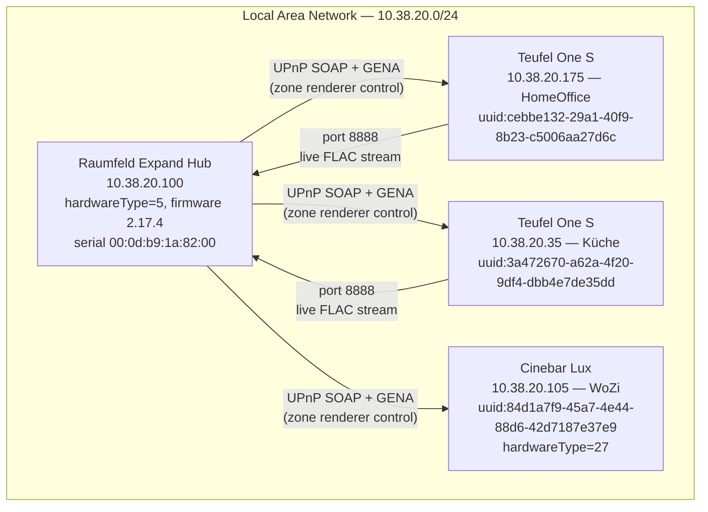
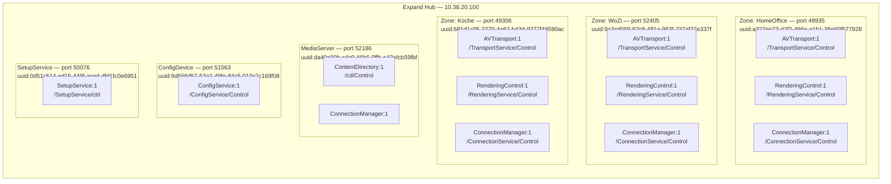

# Raumfeld Topology

This document describes the physical and logical topology of the Teufel/Raumfeld multiroom audio
system as observed by live SCPD enumeration, SOAP probing, GENA subscription, and Android APK
decompilation. All facts are evidence-graded; see the legend below.

**Evidence grades:** `[CONFIRMED]` SOAP response received · `[OBSERVED]` seen in GENA/HTTP ·
`[APK]` from JADX-decompiled app · `[INFERRED]` logical conclusion · `[UNTESTED]` in SCPD only ·
`[HTTP-500]` action exists but returned 500

---

## Physical Deployment

The Expand hub (10.38.20.100) is the UPnP authority for the installation [CONFIRMED]. Physical
speakers are also on the LAN and accept direct UPnP SOAP on their own ports [CONFIRMED]; they are
**not** connected via a proprietary RF bus.



---

## UPnP Service Map — Hub (10.38.20.100)

All virtual devices and services are hosted directly on the Expand hub. Each service has its own
TCP port [CONFIRMED].



---

## Zones (Virtual Renderers)

The Expand hub synthesizes one virtual `MediaRenderer:1` device per configured zone [CONFIRMED].
These are the **only** correct targets for transport control commands — physical speaker IPs must
not be used for playback control.

| Zone | UDN | Port |
|---|---|---|
| HomeOffice | `uuid:a322ee73-d2f2-466e-a1b1-36e60f577928` | 49935 |
| WoZi | `uuid:9a3cd069-82c8-481a-963f-237af22e337f` | 52405 |
| Küche | `uuid:681d1c05-2270-4a62-b43d-9777f49590ac` | 49306 |

---

## Per-Zone Service Layout

Each zone renderer exposes three standard UPnP services on a single port on the hub. The control
and event URLs follow a fixed pattern [CONFIRMED].

### Zone: HomeOffice (port 49935)

| Service | Control URL | Event URL |
|---|---|---|
| AVTransport:1 | `http://10.38.20.100:49935/TransportService/Control` | `http://10.38.20.100:49935/TransportService/Event` |
| RenderingControl:1 | `http://10.38.20.100:49935/RenderingService/Control` | `http://10.38.20.100:49935/RenderingService/Event` |
| ConnectionManager:1 | `http://10.38.20.100:49935/ConnectionService/Control` | `http://10.38.20.100:49935/ConnectionService/Event` |

### Zone: WoZi (port 52405)

| Service | Control URL | Event URL |
|---|---|---|
| AVTransport:1 | `http://10.38.20.100:52405/TransportService/Control` | `http://10.38.20.100:52405/TransportService/Event` |
| RenderingControl:1 | `http://10.38.20.100:52405/RenderingService/Control` | `http://10.38.20.100:52405/RenderingService/Event` |
| ConnectionManager:1 | `http://10.38.20.100:52405/ConnectionService/Control` | `http://10.38.20.100:52405/ConnectionService/Event` |

### Zone: Küche (port 49306)

| Service | Control URL | Event URL |
|---|---|---|
| AVTransport:1 | `http://10.38.20.100:49306/TransportService/Control` | `http://10.38.20.100:49306/TransportService/Event` |
| RenderingControl:1 | `http://10.38.20.100:49306/RenderingService/Control` | `http://10.38.20.100:49306/RenderingService/Event` |
| ConnectionManager:1 | `http://10.38.20.100:49306/ConnectionService/Control` | `http://10.38.20.100:49306/ConnectionService/Event` |

---

## Hub-Hosted Supporting Services

| Service | UDN | Port | Services |
|---|---|---|---|
| Raumfeld MediaServer | `uuid:da40e00b-c4c0-46b6-9ffb-e42efcb59fbf` | 52186 | ContentDirectory:1, ConnectionManager:1 |
| Raumfeld ConfigDevice | `uuid:9d566d57-53a2-49fe-84c5-010c2c169f08` | 51563 | ConfigService:1 |
| SetupService device | `uuid:0d51c514-ed15-449f-aced-dfd1fc0e6951` | 50076 | SetupService:1 |

**Metadata** [CONFIRMED]: firmware `2.17.4`, protocolVersion `16351`, hardwareType `5` (Expand),
serial `00:0d:b9:1a:82:00`.

---

## Physical Speakers

Physical speakers expose their own UPnP services directly on ephemeral ports. These ports vary
across restarts [OBSERVED]. Port 8888 is stable across reboots on all three devices [CONFIRMED].

| Name | IP | UDN | Model | hardwareType | Open ports (observed) |
|---|---|---|---|---|---|
| Speaker HomeOffice | 10.38.20.175 | `uuid:cebbe132-29a1-40f9-8b23-c5006aa27d6c` | One S | — | 8888, 52859, 54129, 55196, 55425, 56390 |
| Speaker Küche | 10.38.20.35 | `uuid:3a472670-a62a-4f20-9df4-dbb4e7de35dd` | One S | — | 8888, 50480, 52752, 53535, 53753, 56097 |
| Speaker WoZi | 10.38.20.105 | `uuid:84d1a7f9-45a7-4e44-88d6-42d7187e37e9` | Cinebar Lux | 27 | 8888, 53351, 53717, 56249, 58305, 58392 |

### Physical Speaker Services

Physical speakers run their own UPnP services for device-local configuration. These are distinct
from the zone renderer services on the hub [CONFIRMED].

**One S speakers (HomeOffice + Küche):** RenderingControl (volume/EQ), ConnectionManager,
AVTransport [CONFIRMED]. Line-in FLAC stream on port 8888 [CONFIRMED].

**Cinebar Lux (WoZi):** RenderingControl with extended EQ actions (`GetFilter`, `SetFilter`,
`GetBalance`, `ToggleFilter`) [CONFIRMED], AVTransport with `SetNextAVTransportURI` [CONFIRMED],
ConnectionManager [CONFIRMED], and a `RaumfeldGenerator` service with an empty SCPD [OBSERVED].

| Speaker | Service | Control URL (example, ports vary) |
|---|---|---|
| Cinebar Lux | RenderingControl:1 | `http://10.38.20.105:58305/RenderingControl/ctrl` |
| Cinebar Lux | AVTransport:1 | `http://10.38.20.105:53717/AVTransport/ctrl` |
| Cinebar Lux | RaumfeldGenerator | `http://10.38.20.105:{port}/RaumfeldGenerator/ctrl` |

> **Note**: Physical speaker UPnP ports are ephemeral. Discover current ports via UPnP SSDP or
> by reading the device description at `http://{speaker-ip}:{port}/devicedesc.xml`.

---

## Line-In Streams

Port 8888 on One S speakers serves a continuously live FLAC stream [CONFIRMED]. The stream runs
regardless of whether line-in audio is assigned to any zone; it is always accessible while the
speaker is powered.

| Speaker | Stream URL | MIME type |
|---|---|---|
| Speaker Küche | `http://10.38.20.35:8888/stream.flac` | `audio/x-flac` |
| Speaker HomeOffice | `http://10.38.20.175:8888/stream.flac` | `audio/x-flac` |
| Cinebar Lux | `http://10.38.20.105:8888/stream.flac` | unknown [UNTESTED] |

Stream characteristics [CONFIRMED]: `Transfer-Encoding: chunked`, `Server: Raumfeld Renderer`,
libFLAC 1.3.1, live audio data (not file-backed). Port 8888 is **also** open on the Cinebar Lux
[OBSERVED], but the Cinebar has digital inputs only and is not listed in the CDS `0/Line In`
container; its stream semantics differ [UNTESTED].

CDS representation (in `0/Line In`): UPnP class `object.item.audioItem.audioBroadcast.lineIn`.

---

## GENA Event Paths

Subscribe by sending an HTTP `SUBSCRIBE` request to the event URL. The hub acknowledges with a
`SID` (subscription ID) and fires an initial `NOTIFY` (SEQ 0) with the full current state [CONFIRMED].

| Zone | Service | Event URL | Subscription timeout |
|---|---|---|---|
| HomeOffice | AVTransport | `http://10.38.20.100:49935/TransportService/Event` | 300 s (hub-enforced) |
| HomeOffice | RenderingControl | `http://10.38.20.100:49935/RenderingService/Event` | 300 s |
| WoZi | AVTransport | `http://10.38.20.100:52405/TransportService/Event` | 300 s |
| WoZi | RenderingControl | `http://10.38.20.100:52405/RenderingService/Event` | 300 s |
| Küche | AVTransport | `http://10.38.20.100:49306/TransportService/Event` | 300 s |
| Küche | RenderingControl | `http://10.38.20.100:49306/RenderingService/Event` | 300 s |

**Raumfeld GENA extensions** [OBSERVED] — additional state variables inside the standard
`LastChange` event body:

| Variable | Service | Example |
|---|---|---|
| `RoomStates` | AVTransport | `uuid:9b109c9c-493a-40a6-9951-30561eebf5b0=STOPPED` |
| `SleepTimerActive` | AVTransport | `0` |
| `SecondsUntilSleep` | AVTransport | `0` |
| `ContentType` | AVTransport | `""` (filled during playback) |
| `Bitrate` | AVTransport | `0` (filled during playback) |
| `RoomVolumes` | RenderingControl | `uuid:9b109c9c-...=28` |
| `RoomMutes` | RenderingControl | `uuid:9b109c9c-...=0` |

Room UUIDs (e.g. `uuid:9b109c9c-493a-40a6-9951-30561eebf5b0`) are a third tier of identifiers,
distinct from both zone renderer UDNs and physical speaker UDNs [OBSERVED].

---

## Model Hierarchy

The software model maps the discovered UPnP topology into a typed Python hierarchy:

```
RaumtubeRegistry
└── Installation  (id="home", name="Home", network=NetworkProfile)
    └── System
        └── TopologyAggregate
            ├── physical_devices
            │   ├── PhysicalDevice(udn="uuid:cebbe132-...", ip="10.38.20.175", role="speaker",   model="One S")
            │   ├── PhysicalDevice(udn="uuid:3a472670-...", ip="10.38.20.35",  role="speaker",   model="One S")
            │   └── PhysicalDevice(udn="uuid:84d1a7f9-...", ip="10.38.20.105", role="soundbar",  model="Cinebar Lux")
            ├── zone_renderers
            │   ├── ZoneRenderer(udn="uuid:a322ee73-...", port=49935, name="HomeOffice")
            │   ├── ZoneRenderer(udn="uuid:9a3cd069-...", port=52405, name="WoZi")
            │   └── ZoneRenderer(udn="uuid:681d1c05-...", port=49306, name="Küche")
            ├── zones
            │   ├── Zone(id="z-homeoffice", renderer_udn="uuid:a322ee73-...")
            │   ├── Zone(id="z-wozi",       renderer_udn="uuid:9a3cd069-...")
            │   └── Zone(id="z-kueche",     renderer_udn="uuid:681d1c05-...")
            └── groups
                └── (empty when no multiroom group is active)
```

---

## Zone → Renderer Resolution

To send a SOAP command to a zone [CONFIRMED]:

```python
zone = topology.get_zone("z-homeoffice")
renderer = topology.get_renderer_for_zone("z-homeoffice")
# renderer.avt_control_url → "http://10.38.20.100:49935/TransportService/Control"
```

`get_renderer_for_zone()` looks up `zone.renderer_udn` in `zone_renderers`. All transport SOAP
calls go to the renderer's control URL — never directly to a physical device IP [INFERRED from
observed behaviour and APK].

---

## Coordinator Roles (Single Zone vs. Group)

### Single Zone

```
Zone(id="z-homeoffice")
└── coordinators: []   ← empty; renderer_udn is the transport target
```

In single-zone mode, `Zone.renderer_udn` is used directly as the transport controller.

### Multiroom Group [INFERRED]

```
Group(id="g-1", coordinator_zone_id="z-homeoffice",
      member_zone_ids=["z-homeoffice", "z-wozi"])
Zone(id="z-homeoffice")
└── coordinators:
    ├── Coordinator(renderer_udn="uuid:group-master-...", role="group_master")
    ├── Coordinator(renderer_udn="uuid:clock-...",        role="clock_master")
    └── Coordinator(renderer_udn="uuid:a322ee73-...",     role="transport")
```

Playback commands go to the `transport` coordinator's UDN, which may differ from the zone's base
renderer in a multiroom group. Member zones receive audio via hub-internal routing — no separate
SOAP calls per member [APK].

---

## Group Semantics

| Field | Meaning |
|---|---|
| `Group.coordinator_zone_id` | Zone whose transport coordinator drives all group members |
| `Group.member_zone_ids` | All zones (including coordinator) that play in sync |

To play audio on a group, send `SetAVTransportURI` + `Play` to the **coordinator zone's transport
coordinator**. Member zones receive audio via the hub's internal routing — no separate SOAP calls
per member [APK].

---

## Known Devices — Summary Table

| Friendly Name | Role | IP | UDN | Port(s) |
|---|---|---|---|---|
| Raumfeld Expand | hub | 10.38.20.100 | — | 49935, 52405, 49306, 52186, 51563, 50076 |
| One S (HomeOffice) | speaker | 10.38.20.175 | `uuid:cebbe132-...` | 8888 + ephemeral |
| One S (Küche) | speaker | 10.38.20.35 | `uuid:3a472670-...` | 8888 + ephemeral |
| Cinebar Lux (WoZi) | soundbar | 10.38.20.105 | `uuid:84d1a7f9-...` | 8888 + ephemeral |
